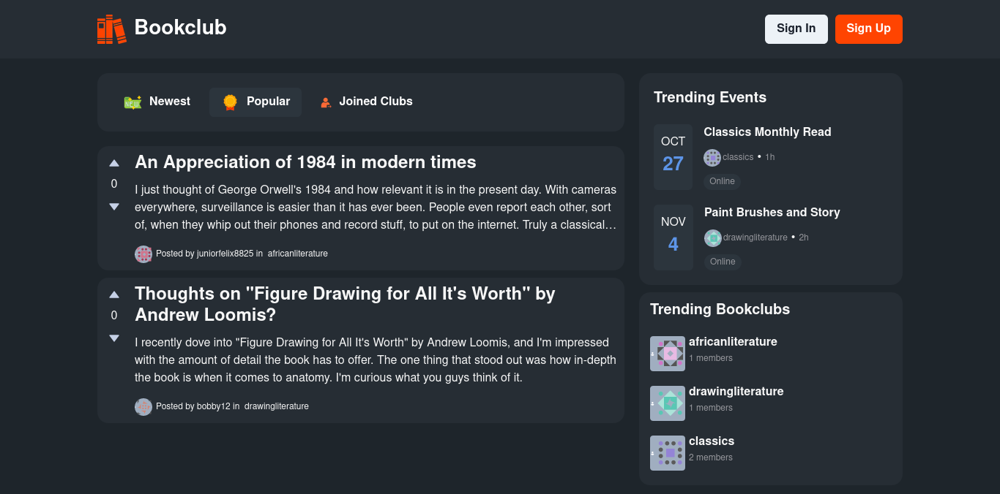

# Bookclub

Bookclub is an online platform where readers from all walks of life can gather to share their thoughts, engage in discussions, and connect with fellow book enthusiasts. Users can create clubs based on genres, authors, or themes, and make posts about their favorite books, reviews, or thought-provoking topics in these clubs. With the option to upvote, downvote, and comment on posts, each community collaboratively can curate the most valuable and engaging content.

## Getting Started

The application can be completed started up by running `docker-compose up` from the command line at the root of the project. Before running this make sure you have the `.env.local` and the `.env.development` defined in the client and api respectively. You can see example ENV files for each one in their respesctive folders.

## Architecture

Below is a basic layout of the building blocks that make up the application:

### Client

The client is a ReactJs application, using the Next.Js framework and TypeScript. Its main function includes displaying the intended user interface, managing application state and making network requests to the api.

To achieve these objectives, the client uses the following packages:

- [Apollo Client](https://www.apollographql.com/docs/react/): For both data fetching and local state management with Apollo cache.

- [Chakra UI](https://chakra-ui.com/): For creating components with ease.

_Additional packages are utilized alongside these two to accomplish the desired functionality._

### API

The API is a NodeJs application that uses the Express Framework and leverages Apollo Server to expose a GraphQL Endpoint. Express provides flexible, robust and efficient server side functionalities while the Apollo Server seamlessly integrates GraphQL functionality, allowing for flexible and efficient data querying and manipulation.

The API uses a PostgreSQL database.
